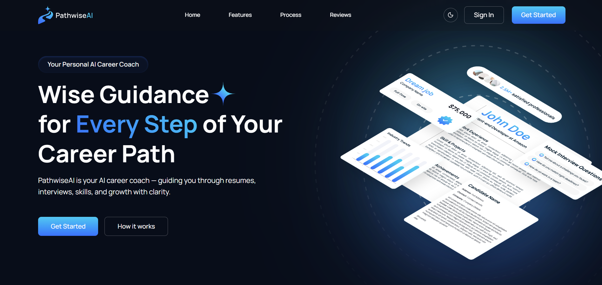
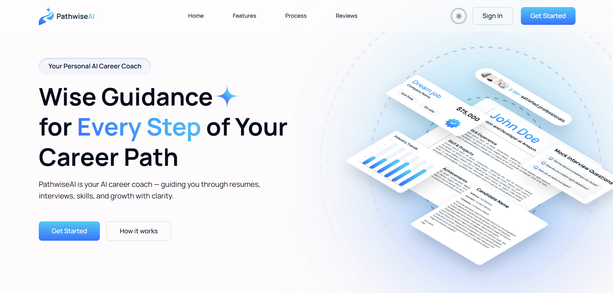

# PathwiseAI — AI-Powered Career Assistant

---

## 🚀 Project Overview

**PathwiseAI** is a comprehensive, AI-powered career management platform designed to guide professionals through every stage of their career journey. From building ATS-optimized resumes and professional cover letters to generating real-time industry insights and conducting mock interviews, PathwiseAI leverages the power of Google Gemini AI to provide personalized, role-specific guidance.

This project was built as a **full-scale personal learning project** to showcase modern frontend development, backend integration, AI implementation, and performance optimization using the latest web technologies.

---

## 🌐 Live Demo

🔗 **Live Website**  
👉 **[PathwiseAI](https://pathwise-ai-pro.vercel.app/)**

---

## 🎯 Key Highlights

- **AI-Driven Personalization**: Tailors all career assets (resumes, cover letters) to specific job roles and industry expectations.
- **Weekly Industry Insights**: Automated background jobs (via Inngest) to keep users updated on latest market trends and skill demands.
- **ATS-Optimized Resume Builder**: A professional markdown editor with AI-powered content generation and PDF export.
- **Mock Interview Simulator**: Realistic role-based interview practice with structured AI feedback on responses.
- **Modern Tech Stack**: Built with Next.js 16, Tailwind CSS 4, and Framer Motion for a premium, responsive experience.

---

## 🛠️ Tech Stack & Tools

### Frontend
- **React 19** — Component-based architecture
- **Next.js 16** — Server-side rendering and App Router
- **Tailwind CSS 4** — Utility-first styling
- **Framer Motion 12** — Animations and transitions
- **Lucide React** — Premium icon set
- **Recharts** — Dynamic data visualization for industry trends

### Backend & AI
- **Google Gemini 1.5/2.5 Flash** — Advanced AI content generation and analysis
- **Prisma (ORM)** — Type-safe database management
- **PostgreSQL (Neon DB)** — Serverless relational database
- **Inngest** — Event-driven background jobs for periodic data updates
- **Clerk** — Robust authentication and user management

### Design & Utilities
- **Figma** — UI/UX design and prototyping
- **React Hook Form & Zod** — Type-safe form validation
- **Sonner** — Elegant toast notifications
- **UIW React MD Editor** — Professional markdown editing experience

---

## ✨ Features

- **Personalized Onboarding**: Tailors the entire platform based on your industry, role, and experience level.
- **AI Career Guidance**: Continuous, personalized advice aligned with your professional growth trajectory.
- **Smart Cover Letter Generator**: Creates role-specific cover letters that articulate your strengths and value.
- **AI Resume Builder**: Builds structured, ATS-friendly resumes with one-click PDF export using `html2pdf.js`.
- **Interactive Mock Interviews**: Simulated interviews with real-time feedback to refine communication and articulation.
- **Data-Driven Insights**: Weekly updated reports on role demand, compensation benchmarks, and evolving skill requirements.
- **Dark / Light Theme Support**: Fully responsive design with theme persistence.

---

## 🎨 Design Process

All visuals and interactions were designed to feel professional and empowering, including:

- **Brand Identity**: Logo and color palette designed to inspire confidence and professional growth.
- **Layout System**: Focused on clarity and ease of use for complex data-driven dashboards.
- **Motion Design**: Subtle, micro-animations using Framer Motion to enhance the premium feel.

🔗 **Figma Design Portfolio**  
👉 **[Harman Khurmi Figma](https://www.figma.com/@harmankhurmi)**

---

## 📸 Screenshots & Mockups

### Hero Section

<!-- ### Dashboard & Insights

### Resume Builder

### Interview Practice
 -->

---

## 📬 Contact

**Harman Khurmi**  
🔗 [GitHub](https://github.com/Harman-khurmi) | [LinkedIn](https://www.linkedin.com/in/harmankhurmi/) | [Portfolio](https://harmanpreet.pop.site/)